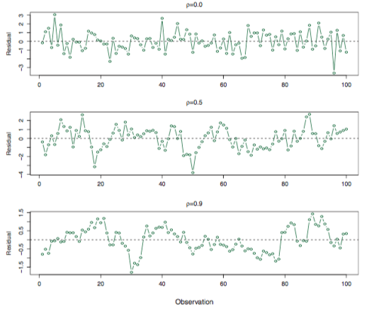

# Models covered
- linear regression
- logistic regression
- decision tree regressor/classifier
- knn
- k-means
- heirarchical clustering
- naive bayes
- random forest regressor/classifier
- adaboost regressor/classifier
- svm/svc
- PCA/PCR

# Linear Regression
## Overview
Ordinary Least Squares (OLS) fits a line to the data with the goal of finding a relationship between one or more predictor variables (X) and a continuous response variable (Y). OLS chooses the line that minimizes the squared residuals (squared difference) between the fitted line, which represents the predictions of Y based on X.

## Pros
- Interpretability - OLS provides an unambigous means of interpreting the relationship between X and Y. Each coefficient represents the effect of one predictor variable (x) on the response variable Y, controlling for all other predictor variables.
- Flexibility
## Cons
- Parametric - OLS depends on the idea that there is a linear relationship between X and Y. This assumption is rarely true for complex, real-world interactions, which means that you will likely have to get very creative with feature engineering (transforming X or Y) or deal with biased predictions.
- Collinearity, multicollinearity, autocorrelation - If one predictor variable is correlated with one or more than one other predictor variable (collinearity and multicollinearity) or correlated with other values of itself (autocorrelation, think stock prices over time), 

# THROW AWAY STUFF
## Assumptions
### Linearity
- There is a linear relationship between the independent and dependent variables. Real world relationships are often messy, so this assumption is frequently violated.
- Detection - Look for non-linear relationships in scatterplots of the dependent variables vs independent variable. If you're feeling fancy, look for a relationship in the plotted residuals. 
- Fix - Consider transforming the dependent variable to reflect the non-linear relationship (X^2, log(X), sqrt(X)) or use a non-parametric model

### Non-correlation of error terms (residuals)
- Assumes that error terms aren't correlated. Put differently, OLS assumes that the fitted line does not systematically over or under-estimate the dependent variable. This assumption is often violated in time series analyses, where adjacent time points will have correlated errors. Correlated error terms mean result in underestimation of the true standard errors, leading to artificially narrower confidence prediction intervals. 
- Detection - Plot the residuals. The first plot shows health, non-correlated error terms. The second and third show the violation of the assumption.

- Fix - Use generalized least squares (GLS), __FIX THIS__ . Good experimental design is another.

### Homoskedasticity (constant variance in error terms) 
- The dependent variable varies equally across a range of independent variables that predict it. Results in biased standard errors but leaves actual estimates unbiased.
- Detection - Plot residuals
- Fix - Transform dependent variable (change scale, log(Y), etc.), or use weighted least squares, which applies weights favoring estimators with less variance in the residuals. 

### No outliers or high leverage points
- Outliers and high leverage points have an outsized influence on the fitted line, potentially leading to biased estimators if those points are not representative of the population.

## Resources
[heteroskedasticity](http://www.statsmakemecry.com/smmctheblog/confusing-stats-terms-explained-heteroscedasticity-heteroske.html)
