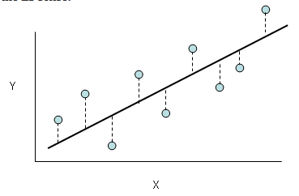

#### Structure
- Overview - A short description of how the model works.
- Applications/examples
- How to
- Merits - The stuff the model is good at
- Risks - You guessed it! Things this model isn't great at.
- Parameters - What you can tune and why you'd tune it
- Extensions - Transformations or similar models
- Resources - The best places to learn more about this model

# Models covered
- linear regression
- logistic regression
- decision tree regressor/classifier
- knn
- k-means
- heirarchical clustering
- naive bayes
- random forest regressor/classifier
- adaboost regressor/classifier
- svm/svc
- PCA/PCR

# Linear Regression
#### Overview
Ordinary Least Squares (OLS) fits a line to the data with the goal of finding a relationship between one or more predictor variables (X) and a continuous response variable (Y). OLS chooses the line that minimizes the squared residuals (squared difference) between the fitted line, which represents the predictions of Y based on X.

#### Merits
- __Interpretability__ - OLS provides an unambigous means of interpreting the relationship between X and Y. Each coefficient represents the effect of one predictor variable (x) on the response variable Y, controlling for all other predictor variables.
- __Speed__ - Generally fast to train, especially when implemeted with stochastic gradient descent. Predictions are just the dot product of coefficient vector and the input matrix and are, therefore, also fast.

#### Risks
__Inflexible__
- Risk: OLS assumes a linear relationship between X and Y. This assumption is rarely true for complex, real-world interactions. 
- Diagnosis: (i) Examine scatterplots of each x vs Y or (ii) look for low R^2 values.
- Fix: Apply feature engineering on variables to reflect the real relationship between X and Y. This can include sqrt(X), X squared, log(X), and many more transformations
__Collinearity, multicollinearity, autocorrelation__ 
- Risk: If two or more predictor variables are correlated, it hurts the interpretability  of their coefficients and creates a situation where a small change in the data may result in a big change in the coefficient.
- Diagnosis: Run a scatterplot or correlation matrix to identify collinearity culprits. Large variance inflation factor values (>5) indicate possible multicollinearity.
- Fix: (i) Drop one or more of the collinear variables or (ii) combine collinear variables into a single predictor (β * x1 * x1). Be sure to abide by the heirarchical principle if you use this.
__Correlated or heteroskedastic errors__ 
- Risk: If the errors (the difference between predicted and actual Y) are correlated or are heteroskedastic (vary irregularly with the predictor), it will result in underestimated, biased standard errors (respectively).
- Diagnosis: Check out a scatterplot of the residuals.
- Fix: For heteroskedasticity, consider (i) transforming Y to even out the variance of the residuals or (ii) using weighted least squares (see below).
- __Outliers and high leverage points__ - Outliers (irregular points, formally 1.5x the [interquartile range](http://www.mathwords.com/o/outlier.htm)) and high leverage points (unusual values of x) wield an outsized influence on the fitted line and may bias predictions.

#### Parameters
- Few, if any parameters to tune in OLS. The heavy lifting really takes place in feature engineering variables.

#### Extensions
- __Weighted Least Squares__ - Combats heteroskedasticity by applying weights favoring estimators with less error term variance.
- __L1/L2 Regularization__ - Combats overfitting by penalizing coefficients as the grow larger. L1 (Lasso) and L2 (Ridge) evaluate the magnitude of coefficients using their absolute value and square, respectively. L1 can drop less important predictors entirely and L2 scales large coefficients more aggressively. The amount of regularization is tuned manually using λ. BE SURE TO NORMALIZE YOUR DATA BEFORE USING THIS EXTENSION! 
- __Least Absolute Residual__ - Replaces the OLS error function of error squared with the absolute value of error, which reduces the impact of outliers and high leverage points on the model. 
- Stochastic gradient descent - 

#### Resources
[correlated error terms and autocorrelation](http://web.stanford.edu/class/stats191/notebooks/Correlated%20errors.pdf)
[heteroskedasticity](http://www.statsmakemecry.com/smmctheblog/confusing-stats-terms-explained-heteroscedasticity-heteroske.html)
