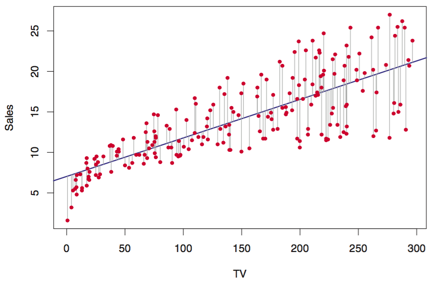

#### Structure
- Overview - A short description of how the model works.
- Applications/examples
- How to
- Merits - The stuff the model is good at
- Risks - You guessed it! Things this model isn't great at.
- Parameters - What you can tune and why you'd tune it
- Extensions - Transformations or similar models
- Resources - The best places to learn more about this model

# Models covered
- linear regression
- logistic regression
- decision tree regressor/classifier
- knn
- k-means
- heirarchical clustering
- naive bayes
- random forest regressor/classifier
- adaboost regressor/classifier
- svm/svc
- PCA/PCR

# Linear Regression
#### Overview
Ordinary Least Squares (OLS) seeks to predict a response variable Y given one or more predictor variables X by fitting a line to express the relationship. OLS chooses the line that minimizes the squared residuals (squared difference) between the predictions of Y, represented by the fitted line, and the actual values of Y.

### Merits
##### Interpretability
OLS provides an unambiguous means of interpreting the relationship between X and Y. Each coefficient represents the effect of a one unit increase in a predictor variable on the response variable Y, controlling for all other predictor variables.

##### Speed
Generally fast to train, especially when implemented with stochastic gradient descent. Predictions are just the dot product of coefficient vector and the input matrix and are also fast.

##### Linear data
OLS assumes a linear relationship between X and Y and therefore does well when that assumption is close to accurate.

### Risks
_1. Risk | 2.Diagnosis | 3.Fix_

##### Non-linear data
1. OLS assumes a linear relationship between X and Y. This assumption is rarely true for complex, real-world interactions.
2. Examine scatterplots of each x vs Y or look for low R^2 values.
3. Apply feature engineering on variables to reflect the real relationship between X and Y.

##### Collinearity, multicollinearity, autocorrelation
1. If two or more predictor variables are correlated, it hurts the interpretability  of their coefficients and creates a situation where a small change in the data may result in a big change in the coefficient.
2. Run a scatterplot or correlation matrix to identify collinearity culprits. Large variance inflation factor values (>5) indicate possible multicollinearity.
3. (i) Drop one or more of the collinear variables or (ii) combine collinear variables into a single predictor. Be sure to abide by the hierarchical principle if you use this.

##### Correlated or heteroskedastic errors
1. If the errors (the difference between predicted and actual Y) are correlated or are heteroskedastic (vary irregularly with the predictor), it will result in underestimated, biased standard errors (respectively).
2. Check out a scatterplot of the residuals.
3. Consider (i) transforming Y to even out the variance of the residuals or (ii) using weighted least squares (see below).

##### Outliers and high leverage points
1. Outliers and high leverage points wield an outsized influence on the fitted line and may bias coefficients and therefore predictions.
2. Look at scatterplot matrix. With exceptions, outliers may be defined as points with values 1.5x outside the [interquartile range](http://www.mathwords.com/o/outlier.htm)). High leverage points, or unusual values of x, may be identified using the leverage statistic.
3. Consider dropping the offending points.

##### Multi-dimensional data
1. Data with numerous predictors can lead to overfitting.
2. Low train error and high test error, in conjunction with a large number of predictors, is a pretty clear signal.
3. Use forward, backward, or mixed selection to limit model to a subset of predictors, ideally those with the greatest predictive power.

### Parameters
Few, if any parameters to tune in OLS. The heavy lifting really takes place in feature engineering variables.

### Extensions
##### Weighted Least Squares
Combats heteroskedasticity by applying weights favoring estimators with less error term variance.
##### L1/L2 Regularization
Combats overfitting by penalizing coefficients as the grow larger. L1 (Lasso) and L2 (Ridge) evaluate the magnitude of coefficients using their absolute value and square, respectively. L1 can drop less important predictors entirely and L2 scales large coefficients more aggressively. The amount of regularization is tuned manually using λ. BE SURE TO NORMALIZE YOUR DATA BEFORE USING THIS EXTENSION!

##### Least Absolute Residual Regression (LAR)
Replaces the OLS error function of error squared with the absolute value of error, which reduces the impact of outliers and high leverage points on the model.
- Stochastic gradient descent -

#### Resources
[correlated error terms and autocorrelation](http://web.stanford.edu/class/stats191/notebooks/Correlated%20errors.pdf)
[heteroskedasticity](http://www.statsmakemecry.com/smmctheblog/confusing-stats-terms-explained-heteroscedasticity-heteroske.html)
